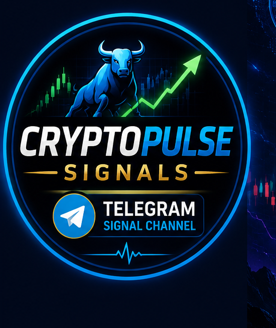

# 🧠 Enhanced Context Engine - What's New

## Overview

The context engine has been **significantly upgraded** from a basic NewsAPI-only system to a **multi-source comprehensive market analysis system**.

---

## 📊 Data Sources (Before vs After)

### ❌ OLD (Basic)
- NewsAPI only (100 requests/day limit)
- Hardcoded economic calendar
- Basic CoinGecko global data
- Simple keyword matching

### ✅ NEW (Enhanced)
1. **NewsAPI** - General crypto news
2. **CryptoCompare News** - Crypto-specific news aggregator
3. **CoinGecko Global** - Full market metrics
4. **CoinGecko BTC Trend** - Bitcoin 7-day trend analysis
5. **Alternative.me Fear & Greed** - Market sentiment index
6. **Combined sentiment analysis** - All sources weighted

---

## 🎯 What This Means for Your Signals

### Better Context Scoring

**Before:** News score based only on NewsAPI articles
**After:** Multi-source weighted analysis including:
- News sentiment from multiple sources
- Fear & Greed index
- BTC price trend
- Market cap changes
- Volume analysis
- High-impact event detection

### More Accurate Risk Detection

**New high-impact keywords tracked:**
- FOMC, Federal Reserve, Interest Rates
- CPI, Inflation data
- ETF approvals/regulatory news
- Exchange hacks/outages
- Whale movements
- Massive liquidations
- War/conflict events

### Better Signal Quality

The enhanced engine now provides:
- ✅ **Fear & Greed Index**: 0-100 market sentiment
- ✅ **BTC Trend Analysis**: 24h and 7d price changes
- ✅ **Market Health Score**: Overall crypto market condition
- ✅ **News Sentiment**: Positive/negative article ratios
- ✅ **High-Impact Warnings**: Automatic caution flags
- ✅ **Volume Anomaly Detection**: Unusual trading activity

---

## 📈 Fear & Greed Index

**What it tells you:**
- **0-24**: Extreme Fear (potential buying opportunity)
- **25-49**: Fear (caution, may be bottoming)
- **50-74**: Greed (market heating up)
- **75-100**: Extreme Greed (potential top, exercise caution)

**How it's used:**
- Signals generated during extreme fear get confidence boost
- Signals during extreme greed get confidence reduction
- Helps avoid buying at tops and selling at bottoms

---

## 🔍 Example Context Summary

When a signal is generated, you now see:

```
😰 Fear & Greed: 28/100 (Fear)
₿ BTC 24h: +2.45%
📊 Market 24h: +1.82%
📰 News: Positive (12+ / 3-)
⚠️ Warnings: Market fear detected
```

This tells you:
- Market is fearful (good for long setups)
- BTC is up today
- Overall market is green
- News is mostly positive
- But caution due to fear sentiment

---

## ⚙️ How It Works

### Data Flow

```
┌─────────────────┐
│  News Sources   │
├─────────────────┤
│ • NewsAPI       │
│ • CryptoCompare │
│ • (More soon)   │
└────────┬────────┘
         │
         ▼
┌─────────────────┐
│ Sentiment       │
│ Analysis        │
│ + High-Impact   │
│ Detection       │
└────────┬────────┘
         │
         ▼
┌─────────────────┐
│ Market Data     │
├─────────────────┤
│ • Fear & Greed  │
│ • BTC Trend     │
│ • Market Cap    │
│ • Volume        │
└────────┬────────┘
         │
         ▼
┌─────────────────┐
│  Context Score  │
│  Calculation    │
├─────────────────┤
│ Macro: 35%      │
│ News: 40%       │
│ Sentiment: 25%  │
└─────────────────┘
```

### Scoring Weights

- **News Analysis (40%)**: Article sentiment, high-impact detection
- **Macro Conditions (35%)**: Fear/Greed, market trends, BTC movement
- **Market Sentiment (25%)**: Volume, market cap changes, overall health

### High-Impact Detection

When high-impact news is detected:
- Context score reduced by 30%
- Signal confidence may drop below threshold
- Prevents trading during major events

---

## 🚀 Benefits for Your Trading

1. **Better Timing**
   - Know when market is fearful (buy)
   - Know when market is greedy (sell)

2. **Risk Management**
   - Automatic avoidance of high-impact events
   - Reduced exposure during market panic

3. **Higher Quality Signals**
   - Multi-source confirmation
   - Better context = better decisions

4. **Transparency**
   - Clear reasoning in every signal
   - Know WHY a signal was generated

---

## 📋 No Action Required

✅ The enhanced engine is already integrated  
✅ All existing code uses it automatically  
✅ Backwards compatible  
✅ No configuration needed  

**Just run your system normally and enjoy better signals!**

---

## 🔮 Future Enhancements

Potential additions (not yet implemented):
- On-chain metrics (Glassnode-style)
- Social media sentiment (Twitter/X)
- Options flow data
- Funding rates analysis
- Liquidation heat maps
- Order book depth analysis

---

## ✅ Summary

**Your context engine now provides:**
- ✅ Multi-source news analysis
- ✅ Fear & Greed index integration
- ✅ BTC trend monitoring
- ✅ Market health assessment
- ✅ High-impact event detection
- ✅ Volume anomaly detection
- ✅ Comprehensive risk warnings

**Result: Higher quality, better timed, safer trading signals!** 🎯
